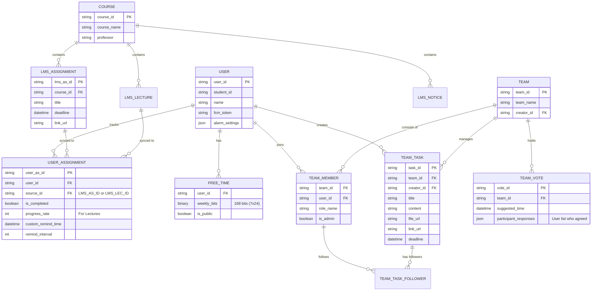

# [회의] 1차

## 결론 요약

---

### 기능 및 방향 수정 & 추가

---

- 과제 수동 추가 → 모의 서버 및 모의 사이트 구축 후 자동 동기화 처리 + 알람 주기 사전 설정 · 수동 편집
- 앱 데이터 연산 목적의 서버 구축,  클라이언트는 입력 / 출력 중심으로 작동하도록 설계 수정
- 조별 시간표 생성 후 `시간대 선택 및 투표, 확정` 이 가능하도록 기능 추가
- 캘린더 연동 기능 **X** ( 본인이 임의로 설정한 `자유 시간`을 조회 및 사용하도록 유지 )
- 과제 범위 확장 : 개인 과제 & 조별 과제 → 개인 과제 & 조별 과제 & 녹화 강의 (new!)
- **서포터**로서의 부가 기능 : 강의 공지 추가 시 알림 기능 ( + 미열람 공지 존재 시 리마인드 알림 )

### 기능 의견 (보류)

---

- 조별 과제 보조 기능 확장 : 앱 내 채팅 시스템 ( 일반적으로 사용되는 카카오톡의 기능까지 가져오자 )
    - 비고 : 기간과 당초 목적에 비해 과한 기능 — 작업이 보다 빠르게 완료될 경우 추가 개발 가능

### 개발 계획

---

- 5주차 (목) 발표에는 설계가 변경된 부분을 중심으로, 별도의 설계 자료도 작성해서 발표
- 이후 6주차 (목)까지 DB 설계 마치기 (이 주간만 파트별로 잦은 회의 및 정리 필요)
- 7 ~ 8주차는 맡은 파트 자유개발 후 데브로그 작성 및 깃허브 리포지토리 커밋 푸시
    - 개발은 각 파트별로 단계를 나눠, 단계별로 진행하며, 완성된 부분까지 발표될 예정

### 기타

---

- 기능 확장에 따른 프로그램명 수정 필요 ( 기존 : AssignmentSupporter )
- 예상 필요 역할 파악 및 조원 내 선호 역할 조사
- 기획서 1차 수정본과 별도로, IA와 기능정의서 작성 필요

## 확장 방안 의견 임시 정리

---

※ 결론은 위에 정리됨

- 교수 의견
    - 별도로 ‘모의 학사행정시스템’ 구축하기
    - 구축된 모의 시스템에 새 과제가 업로드되면 앱에 자동으로 업데이트되도록 하기
        - DB를 우선 만들고, 웹사이트를 나중에 구축하는게 깔끔함
    - 조별로 시간표를 합쳐서 추첨을 받는 기능 ( 이미 있으나 발표에서 깊게 말하지 않았음 ) 추가
    - 채팅 기능 추가
    - 구글 캘린더 연동 → 기각. 쓰는 사람 없고, 자유시간 파악도 어려우며, 개인사를 공개하고 싶지 않음
    - 개인 시간표를 이용한 교집합 조별 시간표에서, 특정 시간을 투표하는 기능
    - 앱 서버를 별도로 두고, 연산을 그쪽으로 옮겨 클라이언트에서는 입력 / 출력만 담당하게 하기

- 조원 의견
    - ‘모의 학사행정시스템’으로 확장되는 김에 `학교 공지`와 `녹화강의 데드라인` 도 연동되도록하기
        - 비슷한 크롬 웹확장이 있으므로 이것을 참
    - AI 기능 → 추가 고려 후 기각됨
    - 리마인더 기능 → 이미 있음
    - 채팅 기능 → 고려는 가능하나 메인이 아님

    # 사이버캠퍼스 웹 구현

## 요약

---

학생 등록 / 수업 / 과제 추가 등에 사용할 수 있는 가상 사이버캠퍼스의 기본적인 기능(유저 추가, 강의, 과제 조회 등)을 구현했습니다.

[Cyber Campus](https://cyber.kosame.dev/)

[GitHub - khk4912/mock-cyber-campus: MobileProgramming Term Proj](https://github.com/khk4912/mock-cyber-campus)

## 작업 기록 (특이사항 위주)

---

# DB설계 초안

- Technologies
    - TypeScript
    - Next.js Web Router
    - React + TailwindCSS
    - Sqlite
- DB ERD
    
    ![mermaid-diagram.png]

#### 사이트 UI

- 로그인 페이지
    
    ![loginPage.png]

- 메인
    
    ![mainPage.png]

- 유저 추가
    
    ![addUserPage.png]
    

## 요약

---

- 

## 작업 기록 (특이사항 위주)

---

# AssignmentHelper 데이터베이스 명세서

## 1. 사용자 및 설정 (Users)

| 필드명 | 타입 | 설명 | 비고 |
| --- | --- | --- | --- |
| `user_id` | String(PK) | 사용자 고유 UID (Firebase Auth) |  |
| `student_id` | String | 학번 |  |
| `user_name` | String | 성명 |  |
| `fcm_token` | String | 푸시 알림 전송을 위한 토큰 |  |
| `free_time_bits` | String | 168자리의 0/1 문자열 또는 Binary | 7일x24시간 프리타임 |
| `is_free_time_public` | Boolean | 그룹 내 공개 여부 |  |

## 2. 사이버캠퍼스 연동 데이터 (LMS Sync)

| 테이블 | 필드 | 타입 | 설명 |
| --- | --- | --- | --- |
| **Courses** | `course_id` | String(PK) | 과목 고유 코드 |
| **LmsAssignments** | `lms_as_id` | String(PK) | 과제 고유 ID |
|  | `type` | Enum | GENERAL(일반과제), LECTURE(녹화강의) |
|  | `deadline` | DateTime | 마감 기한 |
| **LmsNotices** | `notice_id` | String(PK) | 공지사항 고유 ID |
|  | `category` | Enum | URGENT, EXAM, CANCEL, ETC |

## 3. 개인 과제 관리 (User Tracking)

| 필드명 | 타입 | 설명 | 비고 |
| --- | --- | --- | --- |
| `user_id` | String(FK) | 사용자 고유 ID |  |
| `source_id` | String(FK) | LMS 과제/강의 ID |  |
| `is_completed` | Boolean | 완료 여부 |  |
| `remind_cycle` | Integer | 리마인드 주기 (분 단위) |  |
| `is_read` | Boolean | 공지/과제 확인 여부 | 알림 배너용 |

## 4. 조별 과제 (Team Collaboration)
테이블	필드	타입	설명
Teams	team_id	String(PK)	팀 고유 ID
	team_name	String	팀명 (예: 모바일프로그래밍 3조)
TeamMembers	team_id	String(FK)	
	user_id	String(FK)	
	role_name	String	사용자 정의 역할 (자료조사, PPT 등)
TeamTasks	task_id	String(PK)	조별 게시판 할 일/게시물 ID
	target_members	List	알림 수신 대상 (개인 또는 역할)
	file_path	String	Firebase Storage 파일 경로
TeamVotes	vote_id	String(PK)	투표 고유 ID
	common_free_bits	String	교집합 결과 (168bits)
	confirmed_time	DateTime	최종 확정된 미팅 시간

# 관계 설명서 겸 가이드 (초안)

본 문서는 `AssignmentHelper` 앱의 효율적인 데이터 관리와 조별 과제 로직 구현을 위한 DB 구조 및 관계를 설명합니다.

## 1. 데이터 영역 구분 (Domain Logic)

데이터는 크게 세 영역으로 나뉩니다.

1. **LMS 데이터 영역:** 사이버캠퍼스에서 긁어오거나(Mocking) 연동되는 기초 정보 (강의, 과제, 공지)
2. **사용자 맞춤 영역:** 개인별 과제 완료 상태, 리마인드 설정, 개인 프리타임
3. **그룹 협업 영역:** 조별 그룹 정보, 멤버 권한, 공동 게시판, 투표 시스템

## 2. 주요 테이블 관계 설명

### 2.1. 사용자와 개인 설정 (USER & FREE_TIME)

- **USER - FREE_TIME (1:N):** 한 사용자는 자신의 주간 프리타임 데이터를 가집니다. 프리타임은 168비트(7일 × 24시간) 데이터로 저장되어, 추후 조별 교집합 계산 시 비트 연산(`AND`)으로 빠르게 처리됩니다.

### 2.2. LMS 동기화 및 개인 트래킹 (COURSE, ASSIGNMENT & USER_ASSIGNMENT)

- **COURSE - LMS_ASSIGNMENT / LECTURE / NOTICE (1:N):** 하나의 강의는 여러 개의 과제, 강의 영상, 공지사항을 포함합니다.
- **USER - USER_ASSIGNMENT - LMS_ASSIGNMENT (N:M):** 이 앱의 핵심 관계입니다.
    - `LMS_ASSIGNMENT`는 전체 공통 정보(제목, 마감일)를 담고 있습니다.
    - `USER_ASSIGNMENT`는 **"특정 사용자"**가 **"특정 과제"**를 완료했는지, 개인적으로 알림 주기를 어떻게 설정했는지를 담는 중간 테이블입니다.

### 2.3. 조별 협업 시스템 (TEAM & MEMBERS)

- **TEAM - TEAM_MEMBER (1:N):** 그룹이 생성되면 여러 사용자가 멤버로 참여합니다. `TEAM_MEMBER` 테이블에서 `role_name`을 통해 '자료조사', '발표자' 등의 역할을 구분합니다.
- **USER - TEAM_MEMBER (1:N):** 한 사용자는 여러 개의 조별 과제 그룹에 참여할 수 있습니다.

### 2.4. 그룹 게시판 및 팔로우 (TEAM_TASK & FOLLOWER)

- **TEAM - TEAM_TASK (1:N):** 그룹 내에서 생성된 '할 일'이나 '공유 링크'들입니다.
- **TEAM_TASK - TEAM_TASK_FOLLOWER (1:N):** 특정 할 일에 대해 알림을 받을 사람들을 지정합니다. 기획서의 '팔로우' 기능을 구현하기 위한 구조로, 지정된 멤버는 자동으로 팔로워가 되어 상태 변경 시 푸시 알림을 받게 됩니다.

## 3. 핵심 기능 구현을 위한 데이터 흐름 (Data Flow)

### 3.1. 공용 프리타임 추천 로직

1. 그룹 내 모든 `TEAM_MEMBER`의 `user_id`를 추출합니다.
2. 각 `user_id`에 해당하는 `FREE_TIME` 테이블의 `weekly_bits`를 가져옵니다.
3. 서버에서 모든 비트를 `AND` 연산하여 공통 빈 시간을 산출합니다.
4. 산출된 결과를 `TEAM_VOTE` 테이블에 저장하여 멤버들의 투표를 받습니다.

### 3.2. 스마트 리마인더 알림 로직

1. `USER_ASSIGNMENT`에서 마감일이 임박하고 `is_completed`가 `false`인 행을 스캔합니다.
2. 사용자가 설정한 `remind_interval`에 맞춰 `USER` 테이블의 `fcm_token`으로 푸시 알림을 보냅니다.
3. 기한이 초과된 경우, 별도 로직을 통해 하루 2회 강제 알림을 수행합니다.

## 4. 조원 참고사항

- **Firestore 사용 시:** 위 ERD는 관계형 구조를 띄고 있으나, Firestore(NoSQL)로 구현할 때는 `USER_ASSIGNMENT`를 `USER` 문서 하위의 서브 컬렉션으로 구성하여 쿼리 성능을 높일 예정입니다.
- **데이터 일관성:** LMS 데이터가 업데이트되면 이를 참조하는 모든 `USER_ASSIGNMENT`의 마감일 정보도 함께 동기화되어야 하므로 앱 서버의 동기화 로직이 중요합니다.

# [회의] 2차
## 개요

---

- 20시 ~ 21시 간 카카오톡 단체 채팅방을 활용해 회의 진행

## 내용 (결론)

---

1. 사전에 작성한 DB 구조 초안에 대한 확인 요청
2. 기존에 조사하고 나눠진 희망 역할을 기준으로, 기획서 내 6의 단계별로 개발파트를 나눔.
파트는 다음과 같음.
    - 1단계: 장세창 - (핵심기능) 개인 과제 메모 / 리마인더 구현, 모의 사이버캠퍼스 연동
    - 2단계: 고우열 - 공지 알림 기능, 녹화강의 수강 과제 연동
    - 3단계: 심영진 - 프리타임 캘린더, 그룹 생성 및 관리 기능 구현
    - 4단계: 박민기 - 공용 프리타임 시간대 투표 및 확정 기능 구현
    - 5단계: 박필주 - 그룹 게시판 구현 (과제 추가, 팔로우, 알림)
    - 6단계: 황상현 - 그룹 게시판 확장 (파일 · 이미지 · 바로가기 링크 첨부) 기능 구현
    - 단계 외:
        - 김하균 - (웹 서버) 모의 사이버캠퍼스 개선 (API 추가 등)
        - 홍민석 - (앱 서버 및 DB) Firebase 기반 로그인 시스템 및 실제 DB 구현, 공용 프리타임 산출 등 핵심 연산 로직 및 푸시 알림 구현
            - 추후 타 파트와의 연계를 고려해 인원 추가 필요
            - 황다현 - 기획 운영
3. 확정된 기술 스택: Android Studio (Java), XML
4. 기타: 
    - DB 초안은 데브로그에, 기획서는 팀 보드 메인 페이지에 있음
    - 작업 방식
        - 모일 수 있는 시간이 한정적이므로 각자 파트를 맡아 개별 진행
        - 막히는 부분이나 연계가 필요한 부분이 생기면 자유롭게 도움 요청 및 지원 가능
        - 진행된 내용은 깃허브 커밋, 팀 보드 데브로그에 새 페이지 개설 후 작성 등으로 직접 남기기
        - 수요일 밤에 취합해서 목요일 수업 시간 중 발표에 사용할 예정
        - 그 다음 1주간의 진행 방향이나 논의 사항은 목요일 저녁에 일괄 진행 (조원 스케쥴 고려)